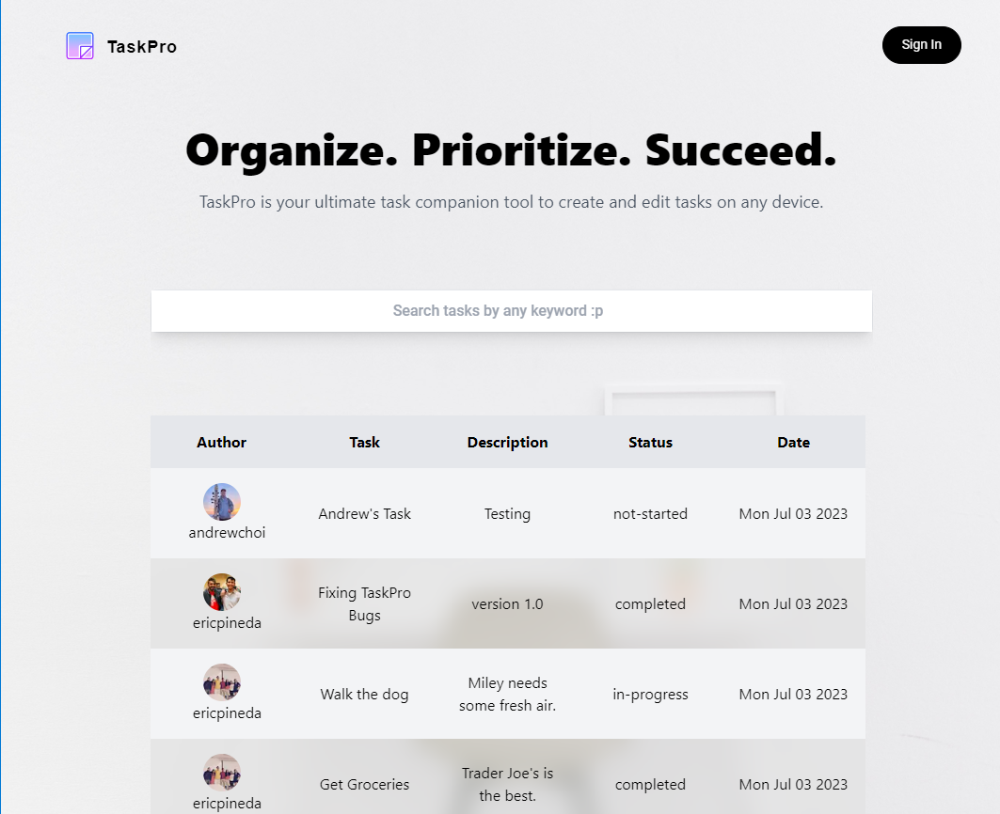

# TaskPro

## Description
- Next.js application to manage tasks with CRUD functions
- Website: [https://taskpro-rho.vercel.app/](https://taskpro-rho.vercel.app/)

## Routes
- Home: Shows all tasks from all users and search bar capability
- Authenication: Uses Google OAuth for user sign in and sign out functionality. 
- Profile: Shows all selected users tasks with ability to edit if user is author. 

## API 
- Backend: [Node.js](https://nodejs.org/en/)
- Frontend Framework: [Next.js](https://nextjs.org/)
- Database: [MongoDB Atlas](https://www.mongodb.com/atlas/database)
- CSS Framework: [Tailwind](https://tailwindcss.com/)
- OAuth: [Google Cloud Platform](https://cloud.google.com)
- Hosted on: [Vercel](https://vercel.com/)